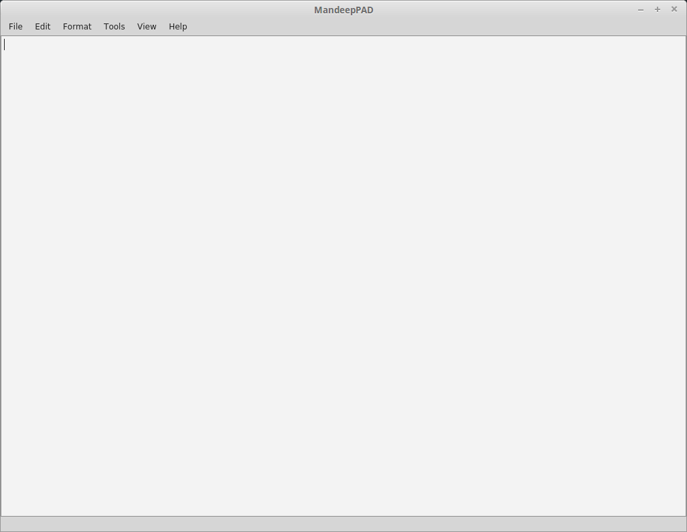

============
MandeepPAD
============

MandeepPAD is a simple text editor built with Python and the PyQt5 library. The application
was created as a way to learn PyQt in addition to continuing a project I created in Visual Basic 6
at the ripe old age of 12.

************
Installation
************

The text editor is dependent on the PyQt5 library. Unfortunately, PyQt5 cannot be installed via
PyPi and needs to be installed separately. Once PyQt5 is installed in the working environment,
MandeepPAD can be installed by invoking the following commands::

    git clone https://github.com/mandeepbhutani/MandeepPAD.git
    pip install /MandeepPAD/

When the package is finished installing, the following command will run the application::

    MandeepPAD
