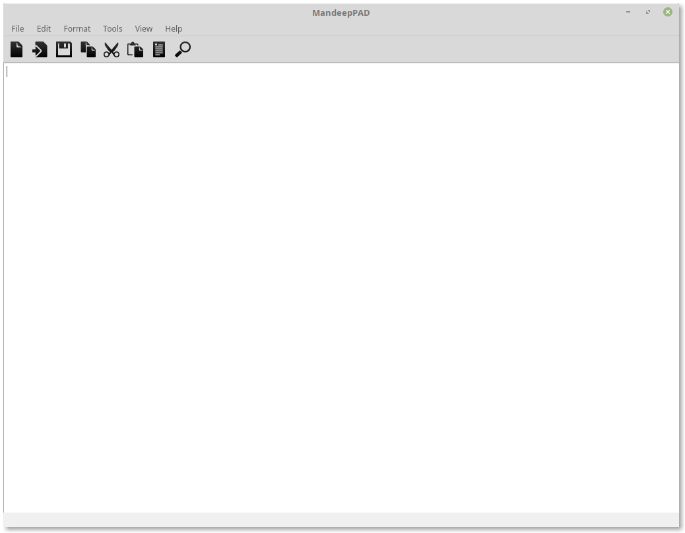

|travis| |coverage|

MandeepPAD is a plaintext editor built with Python and the PyQt5 library. Because Qt5 
optimizes QPlainText for plaintext viewing, the performance of this editor measures
faster than other editors such as pluma and nano. This editor is a continuation 
of a childhood project developed in Visual Basic 6. 

************
Installation
************

The text editor is dependent on the PyQt5 library. If the user's installed Python is 
3.5 or greater, setup.py will attempt to install PyQt5, otherwise please see 
https://riverbankcomputing.com/software/pyqt/download5 for the PyQt5 installation 
instructions. Once PyQt5 is installed in the working environment, MandeepPAD can be 
installed by invoking the following commands::

    git clone https://github.com/mandeep/MandeepPAD.git
    cd MandeepPAD
    pip install .

When the package is finished installing, the following command will run the 
application::

    MandeepPAD

.. |travis| image:: https://travis-ci.org/mandeep/MandeepPAD.svg?branch=master
    :target: https://travis-ci.org/mandeep/MandeepPAD
.. |coverage| image:: https://coveralls.io/repos/github/mandeep/MandeepPAD/badge.svg?branch=master
    :target: https://coveralls.io/github/mandeep/MandeepPAD?branch=master
